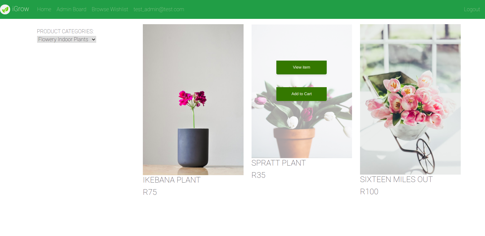

# horticultural-exchange

This is an E-commerce website for public online shoppers interested in buying flowers and plant products.


## Screenshot



## Built with
- Javascript
- Javascript design patterns
- Node.js
- React.js
- Redux
- Amazon Web Services(AWS) S3 Storage
- Stripe
- JSON Web Token (JWT)

## Live Demo link
[Horticultural exchange deployed site on heroku](https://xchange-plant-app.herokuapp.com/)

## Getting Started

To get a local copy up and running follow these simple example steps.

## Prerequisites

- Install node.

## Set up

- Clone the project.
- Cd into the project directory.
- Run ```yarn install``` or ```npm install``` to install dependencies in package.json.
- Run ```yarn start``` or ```npm start```  and view the page on your localhost.

- Clone and run the [backend server](https://github.com/Bluette1/horticultural-exchange-api) locally.


### Login
The user can login via the following roles:
 - Admin: Can manage the stock(create and edit products on sale and categories)
 - Moderator: Can manage the users
 - User: Can view, add and remove items from wishlist and cart and purchase items in the shop.
 - Guest user: Can view, add and remove items from wishlist and cart and purchase items in the shop. Guest user's session information is not persisted when the user logs out.

 #### Available Credentials for Testing purposes
  - Admin user role: email: "test_admin@test.com", password: "password"
  - Moderator user role: "test_moderator@test.com", password: "password"

 ## Features
- The user can access the functions of an E-commerce plant shop   application: 
  - Display a list of available plant products for sale
  - Can view details about a selected plant in the details page
  - Can add and remove a desired plant to their wish list
  - Display a list of the logged in user's wishlist items
  - Can add items to the cart
  - Can checkout out of the plant shop via [Stripe](https://stripe.com/docs/payments/integration-builder)

This project was bootstrapped with [Create React App](https://github.com/facebook/create-react-app).

## Available Scripts

In the project directory, you can run:

### `yarn start`

Run the app in the development mode.\
Open [http://localhost:3001](http://localhost:3001) to view it in the browser.


### `yarn test`

Launch the test runner in the interactive watch mode.\
See the section about [running tests](https://facebook.github.io/create-react-app/docs/running-tests) for more information.


#### Setup - Frontend
- Create a `.env.development` file in the root repository of the project and paste the following:
```REACT_APP_REQUEST_OPTIONS_HOST=<hostname>
REACT_APP_REQUEST_OPTIONS_PORT=<apiPort>
REACT_APP_REQUEST_OPTIONS_HTTP_PROTOCOL=<protocol>
PORT=<port>
 ```

- Create a `.env.production` file in the root repository of the project and paste the following:

```
REACT_APP_REQUEST_OPTIONS_HOST=<host>
REACT_APP_REQUEST_OPTIONS_PORT=<port>
REACT_APP_REQUEST_OPTIONS_HTTP_PROTOCOL=<protocol>

```

### Deployment

This section has moved here: [https://facebook.github.io/create-react-app/docs/deployment](https://facebook.github.io/create-react-app/docs/deployment)
#### Heroku Deployment with Docker
- Instructions can be found [here]( 
 https://betterprogramming.pub/how-to-containerize-and-deploy-apps-with-docker-and-heroku-b1c49e5bc070).


### Integration with Amazon Web Services(AWS) S3 Storage
- Open an account on [Amazon Web Services](https://signin.aws.amazon.com/)
- [Documentation on creating and using AWS S3 Buckets](https://docs.aws.amazon.com/sdk-for-javascript/v3/developer-guide/s3-example-creating-buckets.html#s3-create-presigendurl-put)

### Integration with Stripe payments
- Open an account on [Stripe](https://dashboard.stripe.com/login?redirect=%2Ftest%2Fpayments)
- [Documentation on using Stripe Payments](https://stripe.com/docs/payments/integration-builder)


## Contributions

 If you see something wrong or not working, please check [the issue tracker section](https://github.com/bluette1/horticultural-exchange/issues), if the problem you encountered is not already in the opened issues, then open a new issue by clicking on the `new issue` button.

## Author

👤 **Marylene Sawyer**
- Github: [@Bluette1](https://github.com/Bluette1)
- Twitter: [@MaryleneSawyer](https://twitter.com/MaryleneSawyer)
- Linkedin: [Marylene Sawyer](https://www.linkedin.com/in/marylene-sawyer)

## Acknowledgements
- [Stripe](https://dashboard.stripe.com/login?redirect=%2Ftest%2Fpayments)
- [Amazon Web Services](https://signin.aws.amazon.com/)
- [Microverse](https://www.microverse.org/)
- [Freepik](https://www.freepik.com)
- [Unsplash images](https://unsplash.com/)

## Show your support

Give a ⭐️ if you like this project!

## 📝 License

This project is [MIT](https://opensource.org/licenses/MIT) licensed.